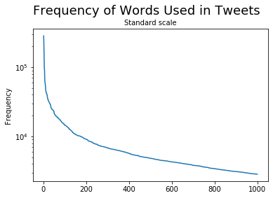
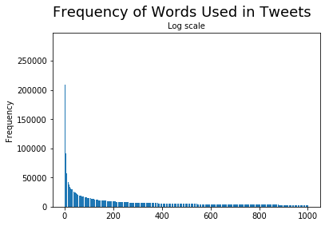
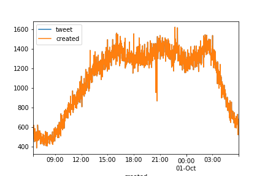

# Twitter-Data-Analysis

This Application analysis tweeter data.

Download the dataset from [URL](https://archive.org/download/archiveteam-twitter-stream-2019-08/twitter_stream_2019_09_30.tar)
 
######It will contain Twitter data collected over a short time period and saved in the Tweet JSON format.

* Convert all alphabetic characters to their lowercase form.
* Use the TweetTokenizer class from nltk.tokenize to tokenize the text.
* Remove stopwords using the nltk.corpus.stopwords module.
* Remove the following tokens: ‘rt’, ‘via’, and ‘...’
* Remove any token that is purely numeric.

For any question that involves the time, you are not required to convert the timestamps to our local time zone. That is, after verifying that the timestamps are all recorded using the same time-zone, you may directly use the timestamps recorded in the dataset without worrying about conversion.
Answer the following questions.

1. How many data records are in your dataset?
2. How many of the tweets in your dataset were newly created? How many tweets were deleted?
For the remainder of the questions in this section, only consider the newly created tweets.
3. What is the timestamp for the earliest tweet in your dataset? What is the timestamp for the latest tweet in your dataset?
4. Create and display a frequency distribution table for the number of hashtags contained in each tweet.
5. Create and display a frequency distribution table for the users mentioned in each tweet. Display the results of this table for the 30 most frequently mentioned users. 
6. Create and display a frequency distribution table for the words used in the text of each tweet. Display the results of this table for the 30 most frequently used words.
7. Create and display histograms for the previous frequency distribution table using both a standard scale and a log scale. For these histograms, expand the results to include the 1000 most frequently used words. Ensure that the data is sorted in descending order. Instead of labeling the horizontal axis using the actual words, enumerate the data points from 1 to 1000, where 1 corresponds to the most frequently appearing word.

8. For this final question, only include tweets whose text includes at least one word from the list of the 30 most frequently used words found above. Group these tweets by the time that they were created using bin widths of 1 minute. Create and display a time series using this resampling.

